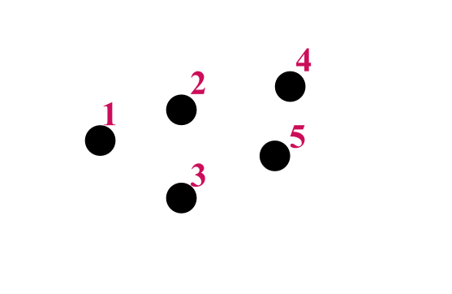

# Traveling Salesman - Genetic Algorithm

## About

The Traveling Salesman problem is one of the most famous example of NP problems :
"Given a list of cities and the distances between each pair of cities,
what is the shortest possible route that visits each city exactly once and returns to the origin city?"

This problem is part of a class of problems said to be NP-complete. These are problems for which no efficient solution
algorithm has been found. For those problems, finding a 'good enough' solution is the next best thing.

## Genetic Algorithm Outline

A genetic algorithm is a metaheuristic algorithm, which 'may provide a sufficiently good solution to an optimization
problem, especially with incomplete or uncertain information' (https://www.aiforanyone.org/glossary/metaheuristic).
In other words, metaheuristic algorithms are often used to find a solution deemed 'good enough' for hard to solve
problems, such as NP-complete/hard problems.
Examples of other metaheuristic algorithms include :
 - Ant colony optimization
 - Particle swarm optimisation

The genetic algorithm is an algorithm inspired by the theory of evolution. The fittest individuals of a population are
selected for reproduction in order to produce new children. After a certain number of generations, we are left with the
fittest individuals.

There are 5 stages to this algorithm:

    1. Initialisation of the population
    2. Fitness function
    3. Selection of the fittest individuals (the parents)
    4. Reproduction
    5. Mutation

(image found at : https://medium.com/@AnasBrital98/genetic-algorithm-explained-76dfbc5de85d)

### GA Terms

#### TSP example map to illustrate the definitions

#### Definitions

1. A population: This is a list or a group of individuals. Each of these individuals are a potential solution to the
problem at hand.
TSP Example: Population = { {1,2,4,5,3}, {1,3,5,4,2}, {1,5,2,3,4}, {1,2,3,4,5}, {1,2,3,5,4}, ... }

2. Chromosomes: An individual from a population is also called a chromosome. It contains parameters (genes) and is a 
potential solution to the problem.
TSP Example: Route = {1,2,4,5,3}

3. Genes: Each chromosome is made up of parameters also called genes. In the TSP, a gene would be a single city such as
TSP Example: City = 1

4. Fitness function: A fitness function is a particular mathematical function which determines the quality of each
individual. This makes it possible to evaluate each potential solution.

## Creating a Genetic Algorithm to solve TSP

### 1. Creating our City Class (Genes)
Our cities represent the genes of our future route chromosomes. Each of those cities has coordinates which allows us to
place them in a space. Cities will therefore need the following attributes:
- x_coordinate
- y_coordinate

Being able to calculate the distance between two cities will be central to our work on the TSP. The City class will
therefore need a method (getDistance()) which will calculate the distance between two cities using the following
formulea : d=√((x2 – x1)² + (y2 – y1)²).

### 2. Creating our Routes (Chromosomes)
Once we have our cities, we can start to create routes. Each of our routes will have a distance, which in turn is
evaluated by our fitness function. Routes will therefore need the following attributes:
- ArrayList < City > route
- routeDistance
- fitness

##### Evaluating each individual (route) using a fitness function:
Choosing a fitness function is a really important step in creating a GA as it will influence reproduction. 'Survival of
the fittest' implies that individuals with better fitness have a higher chance of reproducing and passing
down their genetics.
Using and playing around with different fitness functions allows us to compare their results and suitability. For this
project, two fitness options were explored and tested.
- Normal distribution
- Hyperbole distribution

The Hyperbole distribution would mean that the greater the distance, the lower the fitness would be. Equally, the
smallest the distance (and therefore the better!), the greater the fitness would be.

The Normal distribution on the other hand would give us a higher fitness value the smallest the distance is, and
inversely a smaller fitness value the greater the distance is.

### 3. Creating our Population
Once both our genes and chromosomes have been created, creating our population is straight forward. A population, as
we have seen, is a collection of a certain number of individuals. Therefore, our population will need to have the
following:
- ArrayList < Route > routes
- populationSize

On top of this, some metrics allowing us to measure and keep an eye on the progress of fitness levels during each
generation could be desirable. To do so, we could add two attributes which would calculate respectively the Average
Fitness Level, and the Highest Fitness Level of a generation. This would give us an interesting insight as to how our
population is evolving and should (hopefully!) show an increasingly good fitness value over time.

### 4. Selection
Selection is the first step of the reproductive process of our GA. It consists in selecting two individuals (the
parents) which will reproduce to make an offspring (the child). This can be achieved through a few different
options such as Roulette Wheel Selection, and Tournament Selection, among others. Below you can find the descriptions
for both selection method, however in our case I chose to implement selection using the tournament selection.

#### Tournament Selection:
This selection method is quite simple and consist of the following steps:
- select a number k which will be the matting pool size
- randomly select k individuals from our population to add to the matting pool
- the parent will be the fittest individual in the pool

The number k can be experimented with to see how it influences the GA and carefully selected for best results.

(image found at : https://medium.com/@AnasBrital98/genetic-algorithm-explained-76dfbc5de85d)

#### Roulette Wheel Selection:
This selection method slightly differs from the previous one. In this one, each individual is part of the pool or rather
roulette. The fitness of an individual determines how big of a wedge it gets (and therefore how probably it is going to
be picked). The higher better the fitness, the more chance it has of being selected as a parent.

(image found at : https://medium.com/@AnasBrital98/genetic-algorithm-explained-76dfbc5de85d)

